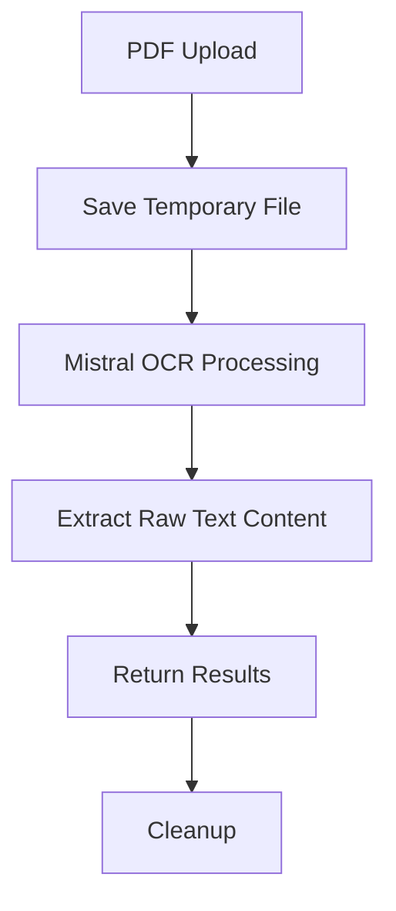

# PDF parser

A Quart-based backend service for the Chinese learning platform, featuring PDF processing with OCR capabilities using Mistral AI. The codebase also includes a basic DeepSeek processor structure for future text processing tasks.

## 🚀 Quick Start

### Prerequisites

- Python 3.8+
- pip (Python package manager)
- Virtual environment (recommended)
- Mistral API key (Free tier or paid plan)
- DeepSeek API key (for future use)

### Environment Setup

1. Create and activate a virtual environment:

```bash
python -m venv venv
source venv/bin/activate  # On Windows: .\venv\Scripts\activate
```

2. Install dependencies:

```bash
pip install -r requirements.txt
```

3. Create a `.env` file in the backend directory:

```env
MISTRAL_API_KEY=your_mistral_api_key
DEEPSEEK_API_KEY=your_deepseek_api_key  # For future use
PORT=5000  # Optional, defaults to 5000
```

### Running the Server

1. Start the development server:

```bash
python app.py
```

The server will start on `http://localhost:5000` by default.

## 📚 API Documentation

### Test Endpoint

- `GET /api/test`: Verify backend is running
  - Response: `{"message": "Backend is running successfully!"}`

### PDF Processing Endpoint

- `POST /api/process`: Process a PDF file
  - Request: Multipart form data with a single file
    - `file`: A PDF file to process
  - Response: Processing result with extracted raw content from the PDF file

## 🔧 Core Components

### PDF Processing System

#### OCR Processing

- Uses Mistral's OCR API for PDF text extraction
- Maintains document structure and formatting
- Supports both text-based and image-based PDFs
- Returns raw text content from the PDF

### DeepSeek Processor (Future Use)

A basic structure is provided for the DeepSeek processor, which can be extended later for custom processing tasks.

### PDF Processing Pipeline



## 📦 Project Structure

```
backend/
├── app.py              # Main application entry
├── file_processor.py   # PDF processing logic
├── deepseek_processor.py # DeepSeek API integration (for future use)
├── mistral_processor.py # Mistral API integration
├── requirements.txt    # Dependencies
└── .env               # Environment variables
```

## 🔍 Key Features

### PDF Processing with Mistral OCR

```python
# Process PDF with Mistral OCR
async def process_pdf(file_path):
    # Upload PDF to Mistral
    # Process with OCR
    # Extract raw text content
    # Return results
```

## 🐛 Common Issues & Solutions

### API Limitations

#### Mistral API

- Free Tier:
  - Limited OCR processing
  - File size restrictions
- Paid Plan:
  - Full OCR support
  - Higher rate limits

#### Error Codes

- 422: Invalid endpoint configuration
- 429: Rate limit exceeded
- 403: Free trial limitations

### PDF Processing

- Maximum file size: 10MB per PDF
- Supported formats:
  - Text-based PDFs
  - Image-based PDFs (OCR)
- Common errors:
  - Empty files
  - Corrupted PDFs
  - Password-protected PDFs

### Performance Optimization

- Temporary file management
- Efficient error handling
- Automatic cleanup

## 🔐 Security Notes

- API key protection
- PDF validation
- Secure file handling
- Temporary file cleanup
- Base64 encoding for storage

## 📝 License

This project is licensed under the MIT License - see the LICENSE file for details.

## 🔄 Processing Workflow

### 1. PDF Reception

- Validate PDF file
- Create temporary storage
- Initialize processing pipeline

### 2. Processing Strategy

- Upload PDF to Mistral
- Process with OCR API
- Extract raw text content
- Maintain document structure

### 3. Result Management

- Return structured response
- Clean up resources

## 🚀 Performance Tips

1. **Error Handling**

   - Implement proper error handling
   - Log processing steps
   - Maintain result structure

2. **Resource Management**
   - Clean temporary files
   - Monitor memory usage
   - Optimize processing
